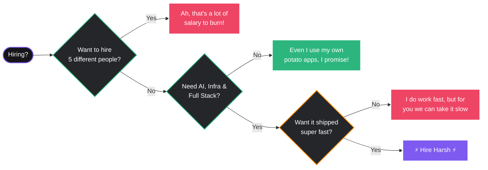

<!-- HEADER SECTION -->

  
  
  

    
    
    
    
    
    
  

   

  

 

  

<!-- ABOUT ME - 3D Card Layout via Blockquote -->
 

  <h2> About Me</h2>

<table align="center" width="100%" style="border-collapse: collapse; border: none;">
  <tr style="border: none;">
    <td width="60%" valign="top" style="border: none;">
      <blockquote>
        <h3 align="left">What I Do</h3>
        

          • Building <b>AI agents</b>, local RAG systems & side projects 
          • Creating scalable AI pipelines with <b>LLMs & automation</b> 
          • Engineering full-stack systems with <b>clean architecture</b> 
          • Exploring infra, distributed systems & local AI deployment 
          • Shipping cross-platform apps with <b>Flutter</b>
        

      </blockquote>
      <blockquote>
        <h3 align="left">Currently Learning</h3>
        

          Transformer internals • Agentic AI orchestration • Distributed inference systems • Advanced retrieval pipelines • Kubernetes & infra scaling
        

      </blockquote>
    </td>
    <td width="40%" align="center" valign="middle" style="border: none;">
        
       
       
      
    </td>
  </tr>
</table>

 

  

 

<!-- FLAGSHIP PROJECT -->

  <h2> Featured Work</h2>

<table align="center" width="100%" style="border-collapse: collapse; border: none;">
  <tr style="border: none;">
    <td width="50%" align="center" valign="top" style="border: none;">
      <a href="#">
        <!-- Replace with your project screenshot/GIF -->
        
      </a>
    </td>
    <td width="50%" valign="top" style="border: none;">
      <blockquote>
        <h3 align="left">RAG Closed Context QA</h3>
        

          <i>A highly accurate Retrieval-Augmented Generation system designed for closed-context document QA with zero hallucinations.</i>
        

        

          <b>Tech Stack:</b> Python, LangChain, Vector DBs, LLMs 
        

        

          
          
        

      </blockquote>
      <blockquote>
        <h3 align="left">Next Up: Agentic RAGBot</h3>
        

          <i>Building an Agentic AI RAGBot that dynamically falls back to Google Search if the local context lacks the answer.</i>
        

      </blockquote>
    </td>
  </tr>
</table>

 

  

 

<!-- TECH UNIVERSE -->

  <h2> Tech Universe</h2>

  <table width="100%" style="border-collapse: collapse; border: none;">
    <tr style="border: none;">
      <td width="50%" align="center" valign="middle" style="border: none;">
        <blockquote>
          

            <i>Technologies I use to build modern, scalable systems.  
            Always exploring new tools to optimize architecture and developer experience.</i>
          

        </blockquote>
      </td>
      <td width="50%" align="center" valign="middle" style="border: none;">
        
      </td>
    </tr>
  </table>

   

  

    
<b>AI & Machine Learning</b>

     
    
  

   
  
  

    
<b>Full Stack & Backend</b>

     
    
  

   
  
  

    
<b>Cloud, DevOps & Databases</b>

     
    
      
    
  

 

  

 

<!-- THE HIRING FLOWCHART - A bit of humor and logic -->

  <h2> Why might you need me?</h2>

 

  

 

<!-- GITHUB ANALYTICS -->

  <h2> And here's my GitHub report card to prove it</h2>
   
  
  <table style="border-collapse: collapse; border: none;" align="center" width="100%">
    <tr style="border: none;">
      <td width="50%" style="border: none;" align="center" valign="middle">
        
      </td>
      <td width="50%" style="border: none;" align="center" valign="middle">
        
      </td>
    </tr>
  </table>

   

  

    

  <h3>this just looked cool so added it</h3>
  

 

  

 

<!-- WAKATIME STATS -->

  <h2> Weekly Development Breakdown</h2>
   
  <!-- Ensure you set up WAKATIME_API_KEY and GH_TOKEN in your repository secrets for WakaTime Action -->
  

    <!-- START_SECTION:waka -->
    <i>WakaTime metrics will be injected here by GitHub Actions!</i>
    <!-- END_SECTION:waka -->
  

 

  

 

<!-- RECENT ARTICLES -->

  <h2> Recent Technical Writings</h2>
   
  <blockquote>
    

      <!-- The GitHub Action will inject your latest blog posts here -->
      <!-- BLOG-POST-LIST:START -->
      <i>Articles will appear here once the GitHub Action runs!</i>
      <!-- BLOG-POST-LIST:END -->
    

  </blockquote>

 

  

 

<!-- DYNAMIC QUOTE -->

  <h2> Quote of the Day</h2>
   
  

 

  

 

<!-- FOOTER -->

  <blockquote>
    <h3>Building cool things, one commit at a time.</h3>
    
<i>Building AI systems that feel magical. Learning distributed infra and agentic workflows. Turning random ideas into real products. Probably debugging something right now. Shipping > Perfecting > Planning.</i>

  </blockquote>

   

  
  
    

  

