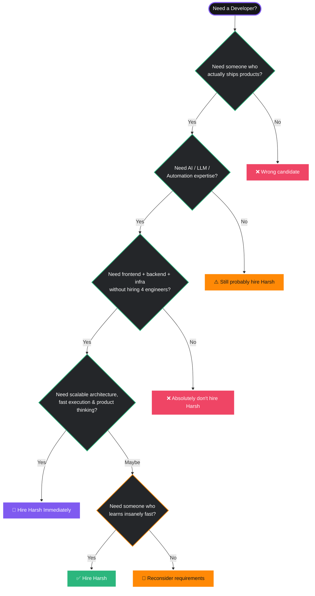

#  Hey, I'm Harsh Verma

<div align="center">


<br/>


</div>

---

#  About Me

<table>
<tr>
<td width="60%">

### 🧠 What I Do

* 🔭 Building **AI agents**, local RAG systems & weird side projects
* ⚡ Creating scalable AI pipelines with **LLMs + automation**
* 🏗️ Engineering full-stack systems with **clean architecture**
* ☁️ Exploring infra, distributed systems & local AI deployment
* 📱 Shipping cross-platform apps with Flutter
* 🤖 Integrating NLP, vector search & agent workflows into products

### 🌱 Currently Learning

* Transformer internals
* Agentic AI orchestration
* Distributed inference systems
* Advanced retrieval pipelines
* Kubernetes & infra scaling

### 🎯 Interests

* ♟️ Chess
* 🐈 Cats
* ☕ Coffee-fueled coding sessions
* 🧩 Solving random tech rabbit holes

</td>

<td width="40%">

<div align="center">


<br/><br/>


<br/>

<br/>


</div>

</td>
</tr>
</table>

---

#  The Hiring Flowchart



---

#  Tech Universe

<div align="center">

### 🤖 AI / Machine Learning


<br/><br/>

### 🌐 Full Stack Development


<br/><br/>

### ☁️ Cloud / DevOps / Infra


<br/><br/>

### 🗄️ Databases


<br/><br/>

### ⚙️ Tools & Workflow


</div>

---

#  What I Bring

<div align="center">

| 🚀 Skill       | 💡 What it means                                 |
| -------------- | ------------------------------------------------ |
| AI Systems     | Building production-ready LLM & RAG applications |
| Full Stack     | Frontend, backend & infra under one roof         |
| System Design  | Architecture that scales beyond tutorials        |
| Automation     | AI workflows that reduce manual effort           |
| Performance    | Optimized systems with real-world usability      |
| Rapid Learning | Adapting fast to new technologies & stacks       |

</div>

---

#  GitHub Analytics

<div align="center">


<br/><br/>


</div>

---

#  Connect With Me

<div align="center">

<a href="https://linkedin.com/in/hashcodes7">

</a>

<a href="https://instagram.com/hersheyyy.sv">

</a>

<a href="https://youtube.com/@HashCodes7">

</a>

<a href="mailto:harshjobs07@gmail.com">

</a>

</div>

---

#  Current Mission

<div align="center">

```txt
> Building AI systems that feel magical.
> Learning distributed infra and agentic workflows.
> Turning random ideas into real products.
> Probably debugging something right now.
```

</div>

---

<div align="center">


<br/><br/>


### 🚀 Building cool things, one commit at a time.

</div>
